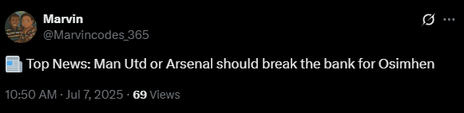
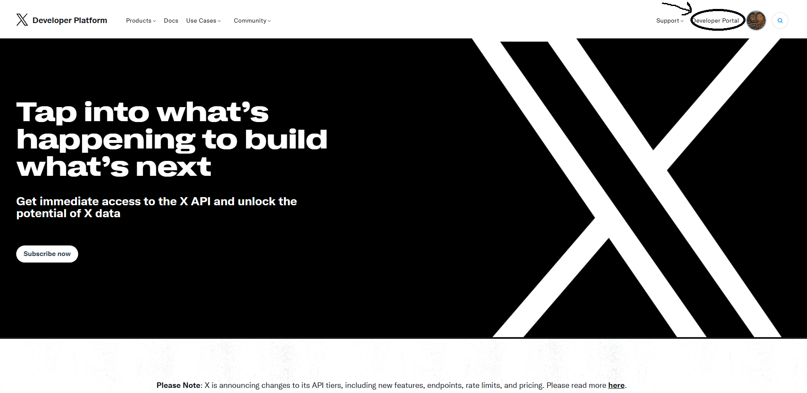
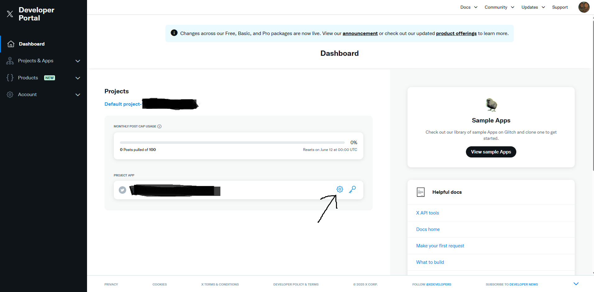

# Newscrape

**Newscrape** is a Python automation script that scrapes the latest headline from [Goal.com Ghana](https://www.goal.com/en-gh) and posts it to Twitter.  
Powered by Selenium and Tweepy, it runs headlessly and can be scheduled to tweet updates at intervals—ideal for football fans, content creators, or social media managers looking to automate news sharing.

---

## 🚀 Features

- 🔎 Scrapes the latest football headline from Goal.com Ghana
- 🐦 Posts headline as a tweet with a news emoji
- 🛡️ Secure API key storage with environment variables
- 🕒 Can run as a scheduled task (e.g., using cron or Windows Task Scheduler)



---

## 🛠️ Tech Stack

- [Python](https://www.python.org/) 3.10+
- [Tweepy](https://docs.tweepy.org/) – Twitter API wrapper
- [Selenium](https://www.selenium.dev/documentation/) – Web automation tool
- [Twitter API v2](https://developer.twitter.com/en/docs/twitter-api) – For posting tweets
- [python-dotenv](https://pypi.org/project/python-dotenv/) – Manage environment variables

---

## ⚙️ Setup

### 1. Clone the Repository

```bash
git clone https://github.com/yourusername/newscrape.git
cd newscrape
```

### 2. Install Dependencies

```bash
pip install -r requirements.txt
```

### 3. Get Twitter API Keys

1. Go to [developer.x.com](https://developer.x.com/en) and log in with your Twitter account.
2. Click **Projects & Apps** in the top menu.
3. Click **+ Create Project** and fill in the details (e.g., "Football Bot").
4. Create an App within the project (e.g., "goal-news-bot") and choose "Read and Write" access.
5. Agree to the terms and finish setup.
6. In your App settings, go to **Keys and Tokens** and generate:
    - API Key
    - API Key Secret
    - Access Token
    - Access Token Secret
    - Bearer Token




### 4. Secure Your Keys in `.env`

Create a `.env` file in the project root and add:

```
API_KEY=your_api_key
API_SECRET=your_api_secret
ACCESS_TOKEN=your_access_token
ACCESS_TOKEN_SECRET=your_access_token_secret
BEARER_TOKEN=your_bearer_token
```

### 5. Download ChromeDriver and Set Path

1. Go to [chromedriver.chromium.org](https://chromedriver.chromium.org/downloads)
2. Download the version that matches your Chrome browser.
3. Extract the file and copy the path to `chromedriver.exe`.
4. In `main.py`, update this line:

```python
path = "C:\\path\\to\\chromedriver.exe"
```

---

## ▶️ How to Run

Run the script from your terminal:

```bash
python main.py
```

---

## 📝 Scheduling (Optional)

You can schedule the script to run at intervals using Windows Task Scheduler or cron (Linux/Mac).

---

## 📄 License

MIT License

---

## 💡 Contributing

Pull requests are welcome! For major changes, please open an issue first to discuss what you would like to change.

---

## 📬 Contact

For questions or suggestions, open an issue or contact [marvinadu2006@gmail.com](mailto:marvinadu2006@gmail.com).
